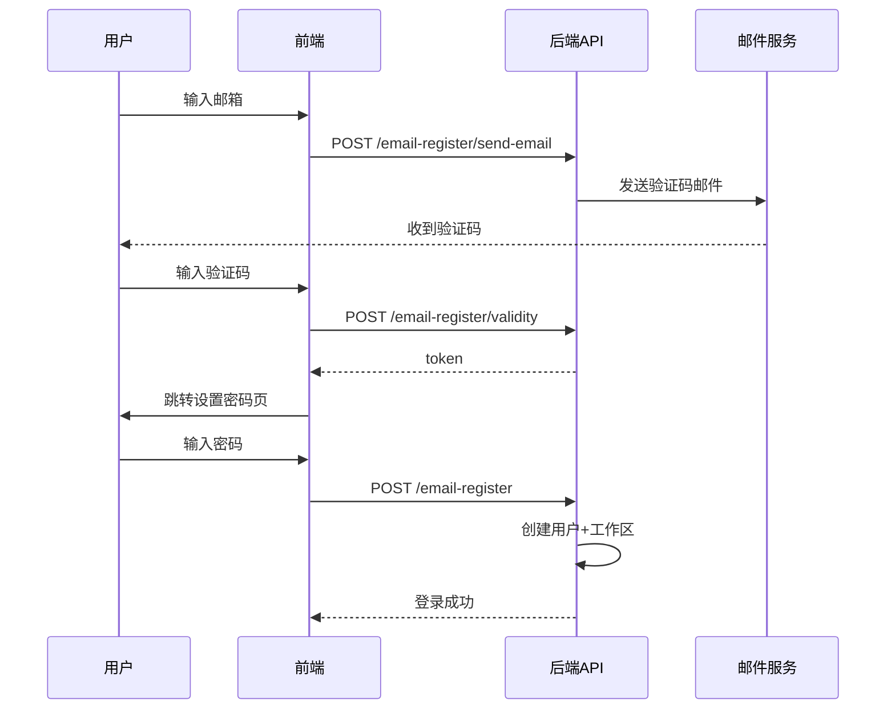
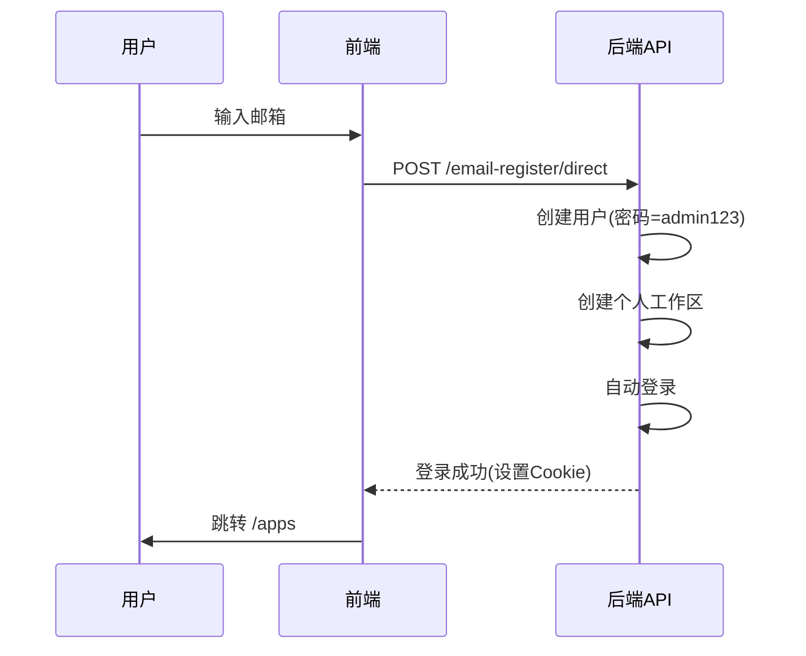

# Dify 免验证码一键注册方案

## 概述

**目标**：用户输入邮箱即可直接注册成功，跳过邮箱验证码和密码设置环节，默认密码为 `admin123`。

**策略**：方案C（只改后端为主 + 前端微调）

---

## 一、当前注册流程（需改造）



## 二、目标流程（改造后）



---

## 三、改造步骤

### Step 1: 后端 — 新增免验证码注册接口

**文件**：[`api/controllers/console/auth/email_register.py`](api/controllers/console/auth/email_register.py)

新增一个 API 端点 `POST /email-register/direct`：

```python
@console_ns.route("/email-register/direct")
class EmailRegisterDirectApi(Resource):
    @setup_required
    @email_password_login_enabled
    @email_register_enabled
    def post(self):
        """一键注册：无需邮箱验证码，默认密码 admin123"""
        args = EmailRegisterDirectPayload.model_validate(console_ns.payload)
        normalized_email = args.email.lower()

        # 检查邮箱是否已被注册
        account = AccountService.get_account_by_email_with_case_fallback(args.email)
        if account:
            raise EmailAlreadyInUseError()

        # 创建用户 + 工作区（密码使用默认值 "admin123"）
        account = AccountService.create_account_and_tenant(
            email=normalized_email,
            name=normalized_email,
            password=DEFAULT_PASSWORD,  # "admin123"
            interface_language=get_valid_language(args.language),
            timezone=args.timezone,
        )

        # 自动登录
        token_pair = AccountService.login(account=account, ip_address=extract_remote_ip(request))
        AccountService.reset_login_error_rate_limit(normalized_email)

        # 设置 Cookie（与 login.py 一致）
        response = make_response({"result": "success"})
        set_access_token_to_cookie(request, response, token_pair.access_token)
        set_refresh_token_to_cookie(request, response, token_pair.refresh_token)
        set_csrf_token_to_cookie(request, response, token_pair.csrf_token)

        return response
```

**新增 Payload 模型**：

```python
class EmailRegisterDirectPayload(BaseModel):
    email: EmailStr = Field(..., description="Email address")
    language: str | None = Field(default=None, description="Language code")
    timezone: str | None = Field(default=None, description="Timezone")

    @field_validator("timezone")
    @classmethod
    def validate_timezone(cls, value: str | None) -> str | None:
        if value is None:
            return None
        return validate_timezone_string(value)
```

### Step 2: 后端 — 处理默认密码绕过验证

**文件**：[`api/services/account_service.py`](api/services/account_service.py)

`create_account()` 方法中调用了 `valid_password(password)`，但 `admin123` 不符合密码规则（需要字母+数字，至少8位）。

**方案**：在 `create_account()` 中，当密码为 `admin123` 时跳过 `valid_password` 校验，直接哈希。

修改 [`api/services/account_service.py:347`](api/services/account_service.py:347)：

```python
# 修改前
if password:
    valid_password(password)
    ...

# 修改后
if password:
    # 默认密码 "admin123" 跳过复杂校验
    if password != DEFAULT_PASSWORD:
        valid_password(password)
    ...
```

或者在常量文件中定义：

```python
# api/configs/feature/__init__.py 或 api/constants/__init__.py
DEFAULT_REGISTER_PASSWORD = "admin123"
```

### Step 3: 后端 — 注册新接口到 schema 注册

**文件**：[`api/controllers/console/auth/email_register.py`](api/controllers/console/auth/email_register.py)

在文件开头的 schema 注册处添加新 Payload：

```python
register_schema_models(
    console_ns,
    EmailRegisterSendPayload,
    EmailRegisterValidityPayload,
    EmailRegisterResetPayload,
    EmailRegisterDirectPayload,  # 新增
)
```

### Step 4: 前端 — 修改注册页面

**文件**：[`web/app/signup/components/input-mail.tsx`](web/app/signup/components/input-mail.tsx)

修改 `handleSubmit`，直接调用新接口，成功后跳转到 `/apps`：

```typescript
import { useMailRegisterDirect } from '@/service/use-common'

// 在组件内
const { mutateAsync: registerDirect, isPending } = useMailRegisterDirect()

const handleSubmit = useCallback(async () => {
    if (isPending) return
    if (!email) { ... }
    if (!emailRegex.test(email)) { ... }

    const res = await registerDirect({
        email,
        language: locale,
        timezone: getBrowserTimezone(),
    })
    if ((res as { result: string }).result === 'success') {
        toast.success(t('api.actionSuccess', { ns: 'common' }))
        router.replace('/apps')
    }
}, [email, locale, registerDirect, t, isPending, router])
```

同时修改按钮文案，从 "发送验证码" 改为 "注册"。

### Step 5: 前端 — 新增 API 调用

**文件**：[`web/service/use-common.ts`](web/service/use-common.ts)

新增 `useMailRegisterDirect` hook：

```typescript
export const useMailRegisterDirect = () => {
    return useMutation({
        mutationKey: [NAME_SPACE, 'mail-register-direct'],
        mutationFn: (body: {
            email: string
            language?: string
            timezone?: string
        }) => {
            return post<{ result: string }>('/email-register/direct', { body })
        },
    })
}
```

---

## 四、涉及文件清单

| 文件 | 修改类型 | 说明 |
|------|----------|------|
| [`api/controllers/console/auth/email_register.py`](api/controllers/console/auth/email_register.py) | 新增 | 新增 `POST /email-register/direct` 端点 |
| [`api/services/account_service.py`](api/services/account_service.py) | 修改 | `create_account()` 中默认密码 `admin123` 跳过 `valid_password` |
| [`api/constants/__init__.py`](api/constants/__init__.py) 或 `api/configs/feature/__init__.py` | 新增 | 定义 `DEFAULT_REGISTER_PASSWORD = "admin123"` |
| [`web/app/signup/components/input-mail.tsx`](web/app/signup/components/input-mail.tsx) | 修改 | 调用新接口，成功后直接跳转 `/apps` |
| [`web/service/use-common.ts`](web/service/use-common.ts) | 新增 | 新增 `useMailRegisterDirect` hook |

---

## 五、注意事项

### 1. 密码 "admin123" 的安全性
- `admin123` 不符合 `valid_password()` 规则（需要字母+数字，至少8位）
- 需要在 `create_account()` 中特殊处理，跳过校验
- **建议**：用户首次登录后应提示修改密码

### 2. 密码校验绕过位置
[`api/services/account_service.py:347`](api/services/account_service.py:347)：
```python
# 修改前
if password:
    valid_password(password)
    ...

# 修改后
if password:
    if password != DEFAULT_REGISTER_PASSWORD:
        valid_password(password)
    ...
```
[`web/app/signup/components/input-mail.tsx:76`](web/app/signup/components/input-mail.tsx:76)：
```tsx
// 修改前
{t('signup.verifyMail', { ns: 'login' })}

// 修改后
{t('signup.createAccount', { ns: 'login' })}  // 或直接写 "注册"
```

### 4. 国际化文案
如果使用 i18n key，需要在 [`web/i18n/en-US/login.json`](web/i18n/en-US/login.json) 中添加新文案。

---

## 六、完整数据流

```
用户输入邮箱 → 点击"注册"
  → POST /email-register/direct { email, language, timezone }
    → AccountService.create_account_and_tenant(email, password="admin123")
      → AccountService.create_account()  // 跳过 valid_password("admin123")
      → TenantService.create_owner_tenant_if_not_exist()
        → 创建 Tenant("{email}'s Workspace")
        → 创建 TenantAccountJoin(role="owner")
    → AccountService.login()  // 生成 access_token + refresh_token
    → 设置 Cookie → 返回 { result: "success" }
  → 前端收到成功 → router.replace('/apps')
  → 用户已登录，进入应用列表
```

---

## 七、后续优化建议

1. **首次登录强制改密**：检测用户密码是否为 `admin123`，跳转到修改密码页面
2. **可配置默认密码**：将 `DEFAULT_REGISTER_PASSWORD` 改为环境变量，方便不同部署环境
3. **管理员开关**：在管理后台增加"免验证码注册"开关，控制是否启用此模式
